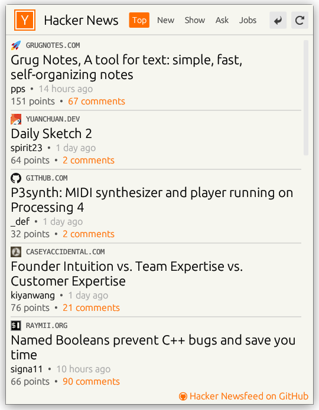

# Hacker Newsfeed

App for reading [Hacker News](https://news.ycombinator.com/).

## Features

- Tabs to browse Top, New, Show HN, Ask HN and Jobs stories
- Open external links in browser
- Show comments for stories in app
- Expand and collapse story comments in tree-like structure
- Refresh to load new stories
- Navigation with keyboard shortcuts
- Accessibility and screenreader support
- Made with [egui](https://github.com/emilk/egui)

### Keyboard shortcuts

- `F5` - Refresh
- `Backspace` - Go back to story view from comment section
- `Alt + Left Arrow` - Go back a page
- `Alt + Right Arrow` - Got to next page (load more)
- `F12` - Debug menu

### Accessibility keyboard shortcuts
- `Tab` - Focus next ui item
- `Shift + Tab` - Focus previous ui item
- `Space` or `Enter` - interact with ui item (click link/button)

#### License

<a href="LICENSE-APACHE">Apache License, Version 2.0</a> or <a href="LICENSE-MIT">MIT license</a>

